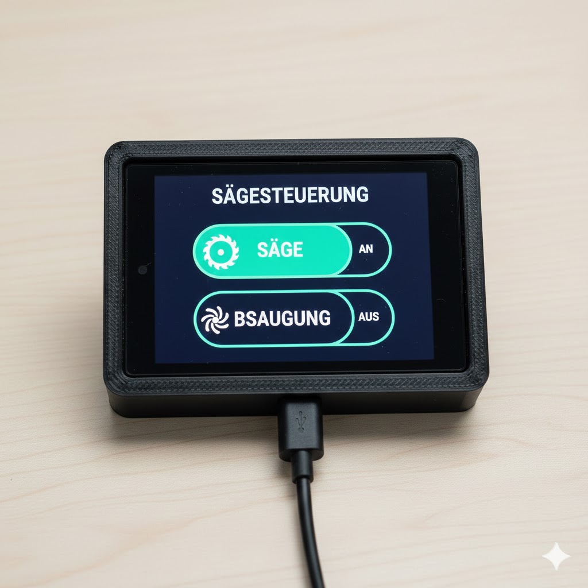

# 🪚 Sägesteuerung – ESP32 Touchdisplay mit ESPHome

Dark-Mode Touchscreen-UI für eine Werkstatt-Sägesteuerung auf dem **WT32-SC01** Display (ESP32 + 3.5" ILI9xxx).  
Zwei große Toggle-Buttons im Kapsel/Pill-Design steuern **Säge** und **Absaugung** – direkt am Gerät oder über Home Assistant.



---

## ✨ Features

- **Dark-Mode UI** – Optimiert für hohen Kontrast in Werkstattumgebungen
- **2 Toggle-Buttons** (Säge & Absaugung) im Pill/Kapsel-Design mit Türkis/Mint-Akzent
- **Lokale Switches** – Die Entitäten leben auf dem ESP, kein manuelles Anlegen in HA nötig
- **Bidirektional** – Steuerung sowohl über das Touch-Display als auch über Home Assistant
- **Offline-fähig** – Funktioniert auch ohne Home Assistant Verbindung
- **Auto-Dimming** – Display dimmt nach 30s Inaktivität automatisch herunter
- **WiFi-Statusanzeige** – Kleine Anzeige unten links

---

## 🛠 Hardware

- **Display:** [WT32-SC01](http://www.wireless-tag.com/product-item-2.html) (ESP32-WROVER + 3.5" 480×320 ILI9xxx Touchscreen)
- **Kein weiteres Zubehör nötig** – Alles über Touch & WiFi

---

## 🚀 Installation

### 1. Repository klonen

```bash
git clone https://github.com/DEIN_USERNAME/ESP-SaegeDisplay.git
cd ESP-SaegeDisplay/wt32sc01-with-esphome
```

### 2. Secrets anlegen

Kopiere die Beispiel-Datei und trage deine echten Werte ein:

```bash
cp secrets.yaml.example secrets.yaml
```

Öffne `secrets.yaml` und passe an:

```yaml
ha_defaultkey: "DEIN_BASE64_API_KEY"     # HA API-Schlüssel
esphome_ota_pw: "dein_ota_passwort"       # OTA-Update Passwort
wifi_ssid_iot: "DEIN_WLAN_NAME"           # WiFi SSID
wifi_pw_iot: "DEIN_WLAN_PASSWORT"         # WiFi Passwort
ip_saegesteuerung: "192.168.1.100"        # Statische IP des Displays
ip_iot_gateway: "192.168.1.1"             # Gateway
ip_iot_subnet: "255.255.255.0"            # Subnetz
ip_iot_dns: "192.168.1.1"                 # DNS Server
esphome_fb_pw: "fallback_passwort"        # Fallback-Hotspot Passwort
```

> ⚠️ **`secrets.yaml` wird per `.gitignore` nicht committed – deine Zugangsdaten sind sicher.**

### 3. In ESPHome einbinden

**Variante A – ESPHome Dashboard (empfohlen):**

1. Kopiere den gesamten Ordner `wt32sc01-with-esphome/` in dein ESPHome-Konfigurationsverzeichnis (normalerweise `~/config/esphome/` oder `/config/esphome/` im HA-Container)
2. Die Datei `saegesteuerung.yaml` erscheint automatisch im ESPHome Dashboard
3. Klicke auf **Install** → **Wirelessly** (oder **Plug into this computer** beim ersten Mal)

**Variante B – ESPHome CLI:**

```bash
# Erster Flash über USB:
esphome run saegesteuerung.yaml

# Spätere Updates gehen Over-the-Air:
esphome run saegesteuerung.yaml --device 192.168.1.100
```

**Variante C – Als externes Paket referenzieren (fortgeschritten):**

In deiner eigenen ESPHome-Config kannst du einzelne Dateien per `!include` aus diesem Repo einbinden, nachdem du es lokal geklont hast.

### 4. In Home Assistant verbinden

Nach dem Flashen erscheint das Gerät automatisch in Home Assistant unter **Einstellungen → Geräte & Dienste → ESPHome**.  
Folgende Entitäten werden **automatisch** erstellt:

| Entität | Beschreibung |
|---|---|
| `switch.saegesteuerung_saege` | Toggle für die Säge |
| `switch.saegesteuerung_absaugung` | Toggle für die Absaugung |
| `light.saegesteuerung_backlight` | Display-Helligkeit |

---

## 📁 Projektstruktur

```
wt32sc01-with-esphome/
├── saegesteuerung.yaml      # ← Hauptkonfiguration Sägesteuerung
├── secrets.yaml.example     # Vorlage für secrets.yaml
├── .gitignore               # Schützt secrets.yaml vor Commit
├── includes/
│   ├── iTouch.yaml          # Touch-Helper (mit Debounce)
│   └── iTouch2.yaml         # Touch-Helper (ohne Debounce)
├── images/
│   └── weather1/            # Wetterbilder (für Original-Dashboard)
├── wt32sc01a.yaml           # Original Wetter-Dashboard Variante A
├── wt32sc01b.yaml           # Original Wetter-Dashboard Variante B
└── README.md
```

---

## ⚙️ Anpassung

### Andere Entitäts-Namen

In `saegesteuerung.yaml` unter `substitutions`:

```yaml
substitutions:
  name: "saegesteuerung"        # Gerätename (wird Teil der Entitäts-IDs)
  friendly_name: "Sägesteuerung" # Anzeigename in HA
```

### Statische IP entfernen

Wenn du DHCP statt einer festen IP verwenden willst, entferne den `manual_ip`-Block in der `wifi:`-Sektion.

### Dimming-Timeout ändern

In der `undim_script`-Sektion den `delay`-Wert anpassen (Standard: 30s).

---

## 🔒 Sicherheit

- `secrets.yaml` ist per `.gitignore` geschützt und wird **nicht** ins Repository committed
- Prüfe vor jedem Commit mit `git status`, dass keine sensiblen Dateien enthalten sind
- Der Fallback-Hotspot wird nur aktiv, wenn das konfigurierte WiFi nicht erreichbar ist

---

## 📜 Lizenz & Credits

Basiert auf dem [WT32-SC01 ESPHome-Projekt](https://community.home-assistant.io/t/wt32-sc01-with-esphome/473531) und Beiträgen der Home Assistant Community.

---

## 🗂 Original Wetter-Dashboard

Die Dateien `wt32sc01a.yaml` und `wt32sc01b.yaml` enthalten das originale Wetter-/Smart-Home-Dashboard mit Wettervorhersage, Temperaturanzeigen und 7 Buttons. Siehe die Dateien für Details.


